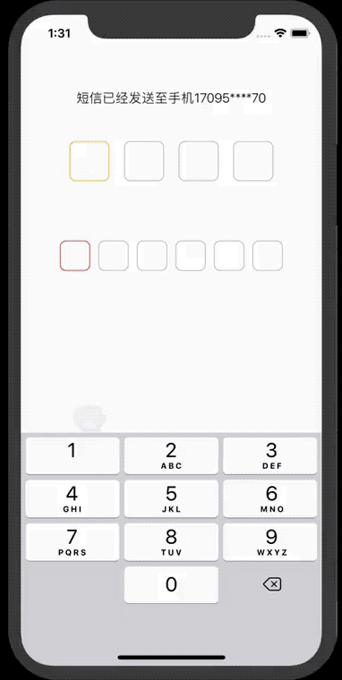

[](https://travis-ci.org/pcjbird/QuickSecurityCode)
[](http://cocoadocs.org/docsets/QuickSecurityCode/)
[](http://cocoadocs.org/docsets/QuickSecurityCode/)
[](https://www.apache.org/licenses/LICENSE-2.0.html)
[](https://github.com/pcjbird/QuickSecurityCode)
[](https://github.com/pcjbird/QuickSecurityCode)
[](https://github.com/pcjbird/QuickSecurityCode/releases)
[](https://github.com/pcjbird/QuickSecurityCode/releases)
[](https://pcjbird.github.io)


# QuickSecurityCode
### A security or sms verify code input control. 一个安全码/短信验证码输入控件，支持4位或6位数字的安全码/短信验证码。

## 特性 / Features

1. 支持4位或6位的安全码/验证码。
2. 设置设置边框颜色，数字字体及颜色。
3. 支持 xib, storyboard。
4. 支持用下划线替代边框模式。

## 演示 / Demo

<p align="center"></p>

##  安装 / Installation

方法一：`QuickSecurityCode` is available through CocoaPods. To install it, simply add the following line to your Podfile:
```
pod 'QuickSecurityCode'
```
## 使用 / Usage
```
#import <QuickSecurityCode/QuickSecurityCode.h>

@interface ViewController ()

@property (weak, nonatomic) IBOutlet QuickSecurityCode *securityCodeCtrl1;
@property (weak, nonatomic) IBOutlet QuickSecurityCode *securityCodeCtrl2;
@property (weak, nonatomic) IBOutlet QuickSecurityCode *securityCodeCtrl3;
@end

@implementation ViewController

- (void)viewDidLoad {
    [super viewDidLoad];
    // Do any additional setup after loading the view, typically from a nib.
    self.securityCodeCtrl1.digitFont = [UIFont boldSystemFontOfSize:18.0f];
    self.securityCodeCtrl1.complete = ^(NSString *code) {
    NSLog(@"SecurityCodeCtrl1: %@", code);
    };

    self.securityCodeCtrl2.complete = ^(NSString *code) {
    NSLog(@"SecurityCodeCtrl2: %@", code);
    };
    
    self.securityCodeCtrl3.digitFont = [UIFont boldSystemFontOfSize:18.0f];
    self.securityCodeCtrl3.complete = ^(NSString *code) {
    NSLog(@"SecurityCodeCtrl3: %@", code);
    };
}

@end
```
## 关注我们 / Follow us
  
  <a href="https://itunes.apple.com/cn/app/iclock-一款满足-挑剔-的翻页时钟与任务闹钟/id1128196970?pt=117947806&ct=com.github.pcjbird.QuickSecurityCode&mt=8"></a>    
  
  [](https://twitter.com/intent/tweet?text=https://github.com/pcjbird/QuickSecurityCode)
  [](https://twitter.com/pcjbird)
